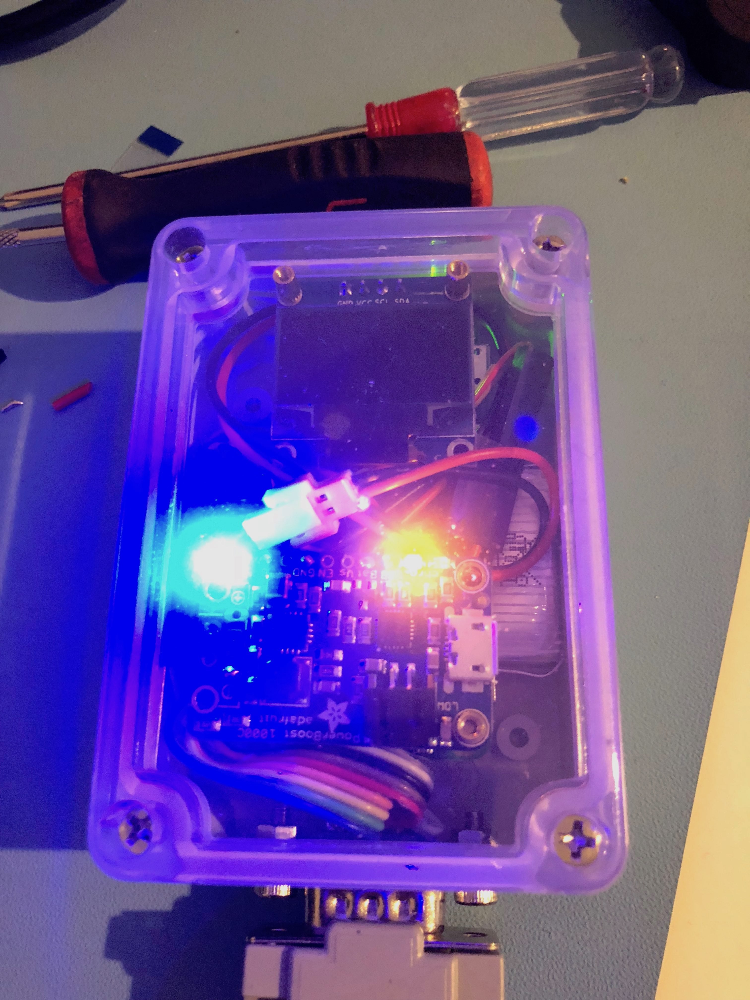
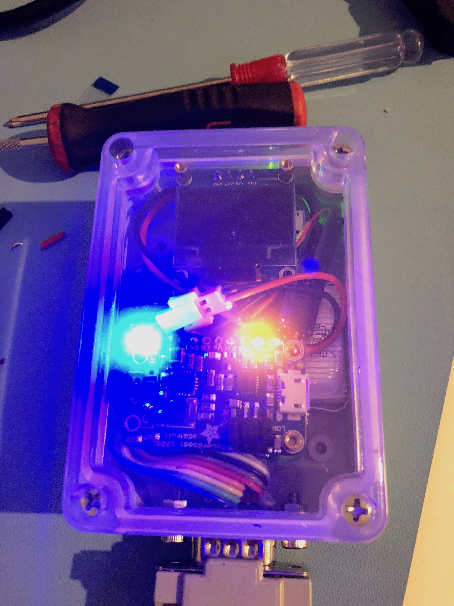

## Overview

Project to have a Raspberry Pi in a box with bluetooth console.  

The original idea of this project was for me to have a 'real' computer that I could take on my commute, 
leave in my bag, and connect/code/play with via a serial terminal on my phone/iPad.

## Hardware

### What It Looks Like

 

## References

"ina" - This was inspired by the character in Terry Pratchett's Discworld called Cut-me-own-throat Dibbler who
sells "sausage-ina-bun" :)

 
